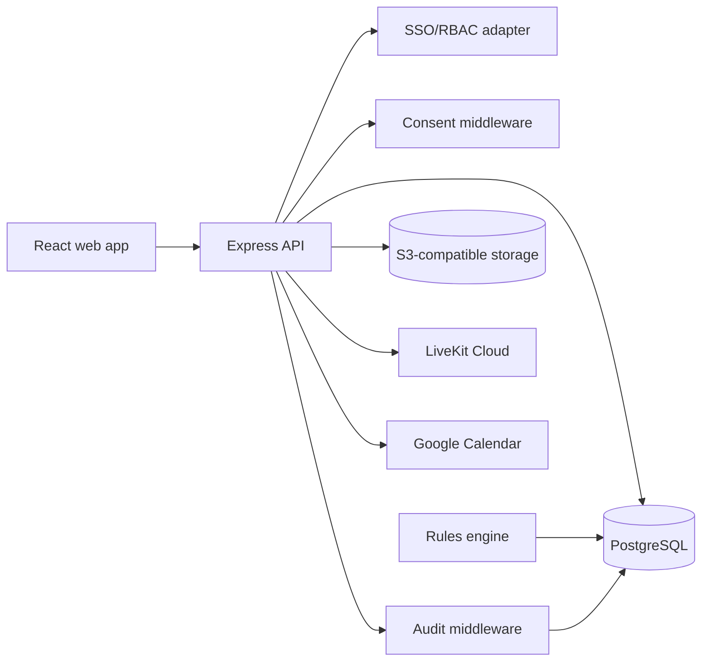

# Architecture

```mermaid
flowchart LR
  Web[React web app] --> API[Express API]
  API --> Auth[SSO/RBAC adapter]
  API --> Consent[Consent middleware]
  API --> Audit[Audit middleware]
  API --> DB[(PostgreSQL)]
  API --> Storage[(S3-compatible storage)]
  API --> Video[LiveKit Cloud]
  API --> Calendar[Google Calendar]
  Rules[Rules engine] --> DB
  Audit --> DB
```

All sensitive reads and writes cross consent and audit layers. Interview feedback is advisory and isolated from the risk flag engine.
